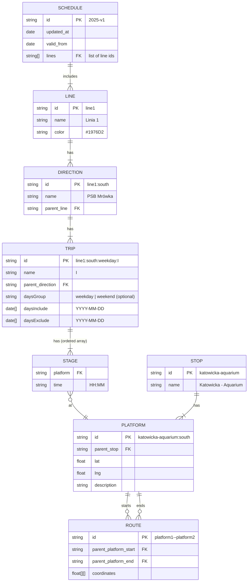

# new data structure

We are going to structure our data like in database, but we will store records in json files. Each type (aka table) in separate file.
All data types stored in simple arrays, with reference to parent objects.

Problem: current structure is mess. Trips are described as trips and shapes. We have two source of truth, unmanagable.

Goal: clear the structure, make the edits and updates easier

# stops
- id: string, not number. Slugify the name, eg. 'katowicka-aquarium
- name: string

# platforms
- id: string. Slugified parent stop and direction, eg. 'katowicka-aquarium-south'. Księże Domki is south direction, Kazimierza Wielkiego / Mszczonowska - north
- parent_stop: id of stop
- lat: float
- lng: float
- description: string

# routes (aka shapes) - middle points between platforms, for drawing polygons on map
- id: string
- parent_platform_start: id of start platform
- parent_platform_end: id of end platform
- coordinates: array of arrays of 2 floats

# trips
- id: string
- name: string (eg. I, II and so)
- parent_direction: id of direction
- stages: array of objects (order = sequence)
    - platform: id of platform
    - time: string "HH:MM"
- daysGroup: weekday or weekend
- daysInclude: array of dates
- daysExclude: array of dates

daysInclude and daysExclude overwrite the daysGroup. This way we can easily exclude christmas or add trips for special occasions

# directions
- id: string
- name: string
- parent_line: id of line

# lines
- id: string
- name: string
- color

# schedules
- id: string
- updated_at: date
- valid_from: date
- lines: list of line ids

'valid_from' allows us to have multiple schedules saved, but display the newest. That way we are able to prepare the schedule before the beginning date and keep the schedule up to date always.

# ID conventions

| Type | Format | Example |
|------|--------|---------|
| stops | `{slugified-name}` | `katowicka-aquarium` |
| platforms | `{stop-id}:{direction}` | `katowicka-aquarium:south` |
| routes | `{start-platform}--{end-platform}` | `katowicka-aquarium:south--katowicka-osiedle:south` |
| directions | `{line-id}:{direction}` | `line1:south` |
| trips | `{direction-id}:{daysGroup}:{name}` | `line1:south:weekday:I` |
| lines | `line{number}` | `line1` |
| schedules | `{year}-{version}` | `2025-v1` |

Date format: `YYYY-MM-DD`

# ER Diagram

